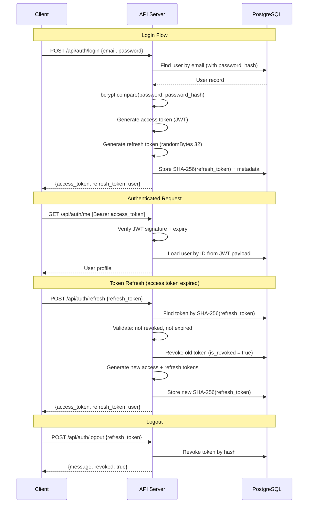
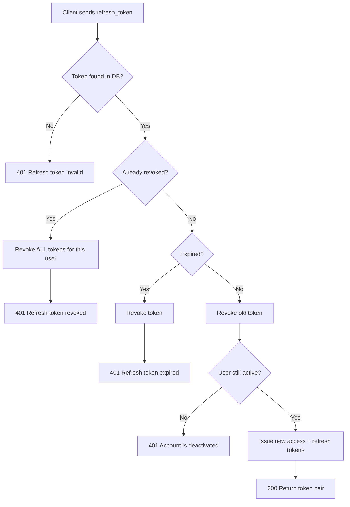
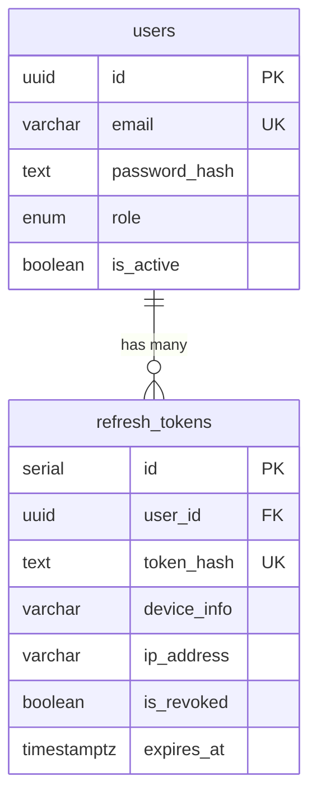

# Authentication System

Technical documentation for the Kanban board authentication system.

## 1. Architecture Overview

### High-Level Flow

The system uses **stateless access tokens** (JWT, short-lived) paired with **stateful refresh tokens** (stored in DB, long-lived) with **token rotation**.

- **Access Token**: Signed JWT, verified by signature alone, never stored in DB. Expires in 1 hour.
- **Refresh Token**: Cryptographically random string (256-bit), SHA-256 hashed before storage. Expires in 30 days. Single-use (rotation on every refresh).

### Token Lifecycle



### Token Rotation with Reuse Detection



## 2. Database Schema

### Users Table

```sql
CREATE TABLE users (
    id              UUID PRIMARY KEY DEFAULT gen_random_uuid(),
    email           VARCHAR(255) NOT NULL UNIQUE,
    full_name       VARCHAR(150) NOT NULL,
    password_hash   TEXT NOT NULL,                              -- bcrypt, select: false in ORM
    role            user_role NOT NULL DEFAULT 'backend_developer',
    team_id         INT REFERENCES teams(id) ON DELETE SET NULL,
    avatar_url      TEXT DEFAULT 'https://api.dicebear.com/9.x/initials/svg?seed=default',
    is_active       BOOLEAN NOT NULL DEFAULT TRUE,
    created_at      TIMESTAMPTZ NOT NULL DEFAULT CURRENT_TIMESTAMP,
    updated_at      TIMESTAMPTZ NOT NULL DEFAULT CURRENT_TIMESTAMP
);

-- Indexes
CREATE INDEX idx_users_role ON users (role);
CREATE INDEX idx_users_team_id ON users (team_id);
CREATE INDEX idx_users_is_active ON users (is_active);
```

**User roles**: `backend_developer`, `frontend_developer`, `fullstack_developer`, `qa`, `devops`, `designer`, `product_manager`, `tech_lead`

### Refresh Tokens Table

```sql
CREATE TABLE refresh_tokens (
    id              SERIAL PRIMARY KEY,
    user_id         UUID NOT NULL REFERENCES users(id) ON DELETE CASCADE,
    token_hash      TEXT NOT NULL UNIQUE,                      -- SHA-256 hash (never store raw)
    device_info     VARCHAR(255),                              -- User-Agent string
    ip_address      VARCHAR(45),                               -- IPv4 or IPv6
    is_revoked      BOOLEAN NOT NULL DEFAULT FALSE,
    expires_at      TIMESTAMPTZ NOT NULL,
    created_at      TIMESTAMPTZ NOT NULL DEFAULT CURRENT_TIMESTAMP
);

CREATE INDEX idx_refresh_tokens_user_id ON refresh_tokens (user_id);
```

### Relationships



### Security Notes

| Column | Protection |
|--------|-----------|
| `users.password_hash` | bcrypt (salt rounds: 10), `select: false` in TypeORM — never included in query results unless explicitly requested |
| `refresh_tokens.token_hash` | SHA-256 hash of raw token — raw token never stored |
| `users.email` | Unique constraint — duplicate checked at application level + DB constraint (Postgres code 23505) for race conditions |

## 3. Backend Implementation (NestJS)

### Module Structure

```
src/modules/auth/
├── auth.module.ts                          # Module definition
├── auth.service.ts                         # Business logic
├── auth.controller.ts                      # HTTP endpoints
├── strategies/
│   └── jwt.strategy.ts                     # Passport JWT strategy
├── guards/
│   └── jwt-auth.guard.ts                   # Route guard
├── decorators/
│   └── current-user.decorator.ts           # @CurrentUser() param decorator
├── entities/
│   └── refresh-token.entity.ts             # TypeORM entity
├── interfaces/
│   └── jwt-payload.interface.ts            # JWT payload type
└── dto/
    ├── register.dto.ts                     # Registration validation
    ├── login.dto.ts                        # Login validation
    ├── refresh-token.dto.ts                # Refresh/logout validation
    └── auth-response.dto.ts                # Response shape
```

### Guards and Strategies

**JwtStrategy** (`strategies/jwt.strategy.ts`)
- Extracts token from `Authorization: Bearer <token>` header
- Verifies signature using `JWT_SECRET` (loaded via `ConfigService.getOrThrow()`)
- Calls `authService.validateUserById()` on every request to ensure user is still active
- Attaches full `User` entity to `request.user`

**JwtAuthGuard** (`guards/jwt-auth.guard.ts`)
- Minimal wrapper around Passport's `AuthGuard('jwt')`
- Apply with `@UseGuards(JwtAuthGuard)` on protected routes

**@CurrentUser() Decorator** (`decorators/current-user.decorator.ts`)
- Extracts `request.user` set by the JWT strategy
- Supports property access: `@CurrentUser('id')` returns just the user ID

### Login Flow

```typescript
// AuthService.login()
1. Find user by email (with password_hash via addSelect)
2. If not found → 401 "Invalid credentials"
3. bcrypt.compare(password, password_hash)
4. If mismatch → 401 "Invalid credentials"        // Same message — no user enumeration
5. Check user.is_active
6. If inactive → 401 "Account is deactivated"
7. Sign JWT access token (1h expiry)
8. Generate refresh token: crypto.randomBytes(32).toString('base64url')
9. Store SHA-256(refresh_token) in refresh_tokens table with device_info + ip_address
10. Return { access_token, refresh_token, user }
```

### Refresh Token Flow

```typescript
// AuthService.refresh()
1. SHA-256 hash the incoming refresh_token
2. Find in DB by token_hash
3. If not found → 401 "Refresh token invalid"
4. If is_revoked === true:
   a. Revoke ALL active tokens for this user (reuse detection)
   b. Log warning
   c. 401 "Refresh token revoked"
5. If expires_at < now:
   a. Mark as revoked
   b. 401 "Refresh token expired"
6. Revoke old token (is_revoked = true)
7. Load user, verify still active
8. Generate new refresh token + store hash
9. Sign new JWT access token
10. Return { access_token, refresh_token, user }
```

### Logout Flow

**Single session** (`POST /api/auth/logout`):
```typescript
// AuthService.logout()
1. SHA-256 hash the refresh_token
2. UPDATE refresh_tokens SET is_revoked = true WHERE token_hash = hash AND is_revoked = false
3. Return boolean (true if token was found and revoked)
```

**All sessions** (`POST /api/auth/logout-all`):
```typescript
// AuthService.logoutAll()
1. Requires valid JWT (protected route)
2. UPDATE refresh_tokens SET is_revoked = true WHERE user_id = userId AND is_revoked = false
3. Return count of revoked sessions
```

### Token Rotation Strategy

Every call to `/api/auth/refresh` **rotates** the refresh token:

1. The old refresh token is revoked immediately
2. A new refresh token is generated and returned
3. The client must store the new refresh token

**Why rotation?** If an attacker steals a refresh token and tries to use it after the legitimate user already rotated it, the server detects reuse (revoked token presented) and revokes **all** sessions for that user as a safety measure.

## 4. Security Considerations

### Password Hashing

- **Algorithm**: bcrypt via `bcryptjs`
- **Salt rounds**: 10
- **Max input**: 72 bytes (enforced by DTO `@MaxLength(72)`)
- **Storage**: `password_hash` column with `select: false` — never loaded unless explicitly requested via `addSelect()`

### Token Storage (Client-Side)

| Method | Access Token | Refresh Token | Notes |
|--------|-------------|---------------|-------|
| **Memory / Store** | Recommended | Recommended | Lost on page refresh, most secure |
| **localStorage** | Acceptable | Acceptable | Persists across tabs, vulnerable to XSS |
| **HttpOnly Cookie** | Best | Best | Requires server-side cookie handling (not currently implemented) |

Current implementation returns tokens in response body — the client decides storage. For highest security, consider migrating to HttpOnly cookies for refresh tokens in a future iteration.

### Refresh Token Storage (Server-Side)

- Raw token is **never stored** — only SHA-256 hash
- Each token records `device_info` (User-Agent) and `ip_address` for audit
- Tokens have explicit `expires_at` timestamp (default: 30 days)
- Revoked tokens remain in DB for reuse detection

### Token Revocation

| Scenario | Action |
|----------|--------|
| User logs out | Single token revoked |
| User logs out all | All active tokens revoked |
| Refresh token reuse detected | **All** tokens for user revoked (theft protection) |
| Token expired | Marked as revoked on next use |
| User deleted | Cascade delete removes all tokens |

### Protection Against Replay Attacks

- Access tokens: short-lived (1h), signed with `JWT_SECRET`, verified on each request
- Refresh tokens: single-use rotation — each token can only be used once
- Reuse detection: presenting an already-rotated token triggers full session revocation

### Anti-Enumeration

- Login returns the same `"Invalid credentials"` message for both wrong email and wrong password
- Registration returns `409` for duplicate email (unavoidable, but standard)

## 5. API Endpoints

### POST /api/auth/register

Register a new user account.

| | |
|---|---|
| **Auth** | Public |
| **Status** | `201 Created` |

**Request:**
```json
{
  "email": "user@example.com",
  "password": "securepass123",
  "full_name": "Jane Doe"
}
```

**Validation:**
- `email` — valid email format (required)
- `password` — string, min 8, max 72 characters (required)
- `full_name` — string, min 1, max 150 characters (required)
- Role is **not** accepted — defaults to `backend_developer` (prevents privilege escalation)

**Response (201):**
```json
{
  "access_token": "eyJhbGciOiJIUzI1NiIs...",
  "refresh_token": "k7Hx9m2Q...",
  "user": {
    "id": "550e8400-e29b-41d4-a716-446655440000",
    "email": "user@example.com",
    "full_name": "Jane Doe",
    "role": "backend_developer",
    "avatar_url": "https://api.dicebear.com/9.x/initials/svg?seed=JD"
  }
}
```

### POST /api/auth/login

Authenticate with email and password.

| | |
|---|---|
| **Auth** | Public |
| **Status** | `200 OK` |

**Request:**
```json
{
  "email": "user@example.com",
  "password": "securepass123"
}
```

**Response (200):** Same shape as register.

### POST /api/auth/refresh

Exchange a refresh token for a new access + refresh token pair.

| | |
|---|---|
| **Auth** | Public |
| **Status** | `200 OK` |

**Request:**
```json
{
  "refresh_token": "k7Hx9m2Q..."
}
```

**Response (200):** Same shape as register (new token pair).

### POST /api/auth/logout

Revoke a single refresh token (single device logout).

| | |
|---|---|
| **Auth** | Public |
| **Status** | `200 OK` |

**Request:**
```json
{
  "refresh_token": "k7Hx9m2Q..."
}
```

**Response (200):**
```json
{
  "message": "Logged out successfully",
  "revoked": true
}
```

If token was not found or already revoked:
```json
{
  "message": "Token not found or already revoked",
  "revoked": false
}
```

### POST /api/auth/logout-all

Revoke all refresh tokens for the authenticated user (all devices).

| | |
|---|---|
| **Auth** | `Authorization: Bearer <access_token>` |
| **Status** | `200 OK` |

**Request:** No body.

**Response (200):**
```json
{
  "message": "All sessions revoked",
  "revoked_count": 3
}
```

### GET /api/auth/me

Get the authenticated user's profile.

| | |
|---|---|
| **Auth** | `Authorization: Bearer <access_token>` |
| **Status** | `200 OK` |

**Response (200):**
```json
{
  "id": "550e8400-e29b-41d4-a716-446655440000",
  "email": "user@example.com",
  "full_name": "Jane Doe",
  "role": "backend_developer",
  "team_id": null,
  "avatar_url": "https://api.dicebear.com/9.x/initials/svg?seed=default",
  "is_active": true,
  "created_at": "2026-02-20T12:00:00.000Z",
  "updated_at": "2026-02-20T12:00:00.000Z"
}
```

## 6. Error Handling

| Scenario | Status | Message |
|----------|--------|---------|
| Wrong email or password | `401` | `"Invalid credentials"` |
| Account deactivated (login) | `401` | `"Account is deactivated"` |
| Account deactivated (refresh) | `401` | `"Account is deactivated"` |
| Account deleted (refresh) | `401` | `"Account no longer exists"` |
| Invalid refresh token | `401` | `"Refresh token invalid"` |
| Expired refresh token | `401` | `"Refresh token expired"` |
| Reused (rotated) refresh token | `401` | `"Refresh token revoked"` |
| Missing/invalid JWT | `401` | `"Unauthorized"` |
| Expired JWT | `401` | `"Unauthorized"` |
| Duplicate email (register) | `409` | `"User with email \"x\" already exists"` |
| Validation failure | `400` | Array of validation messages |
| Missing `JWT_SECRET` env var | App fails to start | `Configuration key "JWT_SECRET" does not exist` |

## 7. Edge Cases

### Multiple Device Login

Each login creates a separate refresh token with its own `device_info` and `ip_address`. A user can have multiple active sessions simultaneously. Each session operates independently.

### Logout All Devices

`POST /api/auth/logout-all` revokes all active refresh tokens for the user. Existing access tokens remain valid until they expire (max 1 hour), but no new access tokens can be obtained via refresh.

### Token Reuse Detection

If a refresh token is used **after** it has already been rotated (indicating potential theft):

1. The server detects the token is already revoked
2. **All** active refresh tokens for that user are revoked
3. A warning is logged: `Refresh token reuse detected — all sessions revoked for user <id>`
4. The request returns `401 "Refresh token revoked"`

This forces the legitimate user (and any attacker) to re-authenticate.

### Concurrent Refresh Requests

If two refresh requests arrive simultaneously with the same token, only one will succeed. The second will see the token as revoked and trigger reuse detection, revoking all sessions. Clients should queue refresh requests and avoid sending multiple concurrent refreshes.

### User Deactivation

When a user's `is_active` is set to `false`:
- Existing access tokens continue working until expiry (stateless)
- The JWT strategy checks `is_active` on every authenticated request — so deactivated users are rejected immediately
- Refresh attempts fail with `"Account is deactivated"`

### Race Condition on Registration

If two registration requests arrive with the same email simultaneously:
- The application-level check (`findOneBy`) may pass for both
- The database unique constraint catches the duplicate
- The Postgres error code `23505` is caught and returned as `409 Conflict`

## 8. Environment Variables

| Variable | Required | Default | Description |
|----------|----------|---------|-------------|
| `JWT_SECRET` | Yes | — | HMAC secret for signing JWTs. App fails to start if missing. |
| `JWT_EXPIRES_IN` | No | `1h` | Access token lifetime (e.g. `15m`, `1h`, `2h`) |
| `REFRESH_TOKEN_EXPIRES_IN` | No | `30d` | Refresh token lifetime in days (e.g. `7d`, `30d`, `90d`) |
