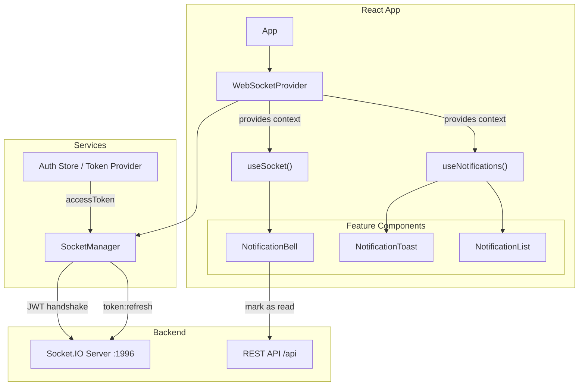
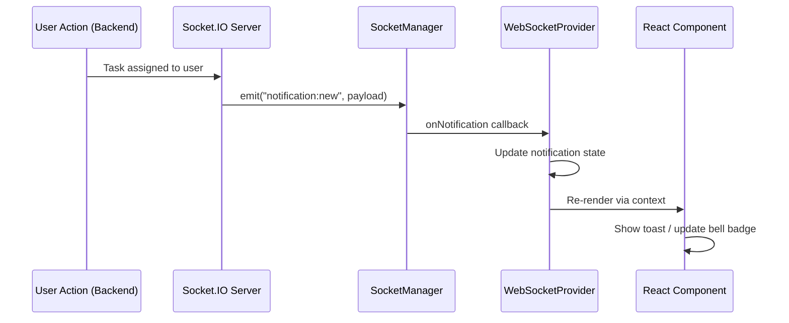
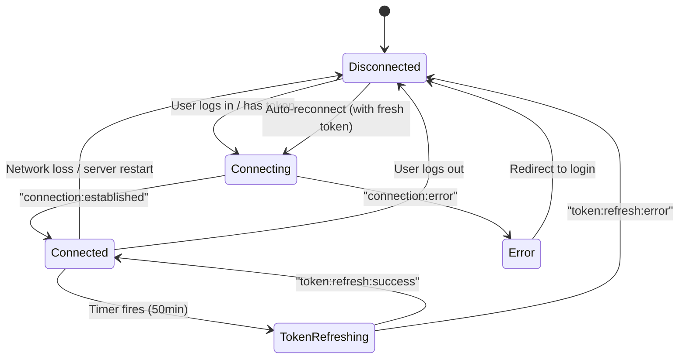
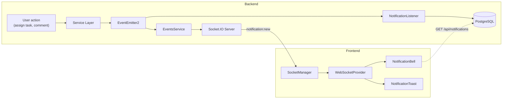
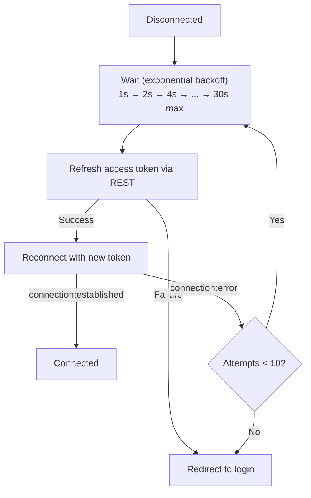
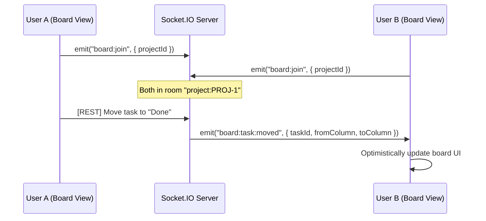

# WebSocket Client Integration Guide — Vite + React

**Feature:** KAN-73 — WebSocket Client Integration
**Date:** 2026-04-30
**Backend:** NestJS + Socket.IO (port 1996)
**Frontend:** Vite + React + TypeScript

---

## 1. Overview

### Summary

This document provides the frontend team with everything needed to integrate the Kanban backend's WebSocket server into a Vite-based React application. It covers setup, authentication, reconnection strategy, token refresh, notification handling, and recommended patterns for state management.

### What the Backend Provides

The backend exposes a Socket.IO server at the root of `http://localhost:1996` (no `/api` prefix — WebSocket is separate from REST). Clients authenticate via JWT in the handshake, receive real-time notification pushes, and can refresh tokens mid-session without reconnecting.

---

## 2. Setup

### Install Dependencies

```bash
pnpm add socket.io-client
```

> **Version compatibility:** The backend uses `socket.io@4.8.x`. Install `socket.io-client@^4.8.0` to ensure protocol compatibility. Major version mismatches (e.g., client v3 vs. server v4) will fail silently.

### Environment Configuration

```env
# .env or .env.local
VITE_WS_URL=http://localhost:1996
```

```typescript
// src/config/env.ts
export const WS_URL = import.meta.env.VITE_WS_URL ?? 'http://localhost:1996';
```

---

## 3. Architecture

### Component Architecture



### Data Flow



---

## 4. Implementation

### 4.1 Socket Manager (Core Service)

This class encapsulates all Socket.IO logic. It is framework-agnostic — no React imports — making it testable and reusable.

```typescript
// src/services/socket-manager.ts
import { io, Socket } from 'socket.io-client';
import { WS_URL } from '../config/env';

export interface WsNotification {
  type: 'comment_created' | 'comment_mentioned' | 'task_assigned' | 'task_updated';
  actorId: string;
  entityType: string;
  entityId: string;
  payload: Record<string, unknown>;
  createdAt: string;
}

export type ConnectionStatus = 'connecting' | 'connected' | 'disconnected' | 'error';

interface SocketManagerOptions {
  getAccessToken: () => string | null;
  refreshAccessToken: () => Promise<string>;
  onNotification: (notification: WsNotification) => void;
  onStatusChange: (status: ConnectionStatus) => void;
}

export class SocketManager {
  private socket: Socket | null = null;
  private options: SocketManagerOptions;
  private refreshTimer: ReturnType<typeof setTimeout> | null = null;

  constructor(options: SocketManagerOptions) {
    this.options = options;
  }

  connect(): void {
    const token = this.options.getAccessToken();
    if (!token) return;

    this.options.onStatusChange('connecting');

    this.socket = io(WS_URL, {
      auth: { token },
      transports: ['websocket', 'polling'],
      reconnection: true,
      reconnectionAttempts: 10,
      reconnectionDelay: 1000,
      reconnectionDelayMax: 30000,
    });

    this.registerListeners();
  }

  disconnect(): void {
    this.clearRefreshTimer();
    if (this.socket) {
      this.socket.removeAllListeners();
      this.socket.disconnect();
      this.socket = null;
    }
    this.options.onStatusChange('disconnected');
  }

  private registerListeners(): void {
    if (!this.socket) return;

    this.socket.on('connection:established', ({ userId }: { userId: string }) => {
      this.options.onStatusChange('connected');
      this.scheduleTokenRefresh();
      console.debug(`[WS] Connected as user ${userId}`);
    });

    this.socket.on('connection:error', ({ message }: { message: string }) => {
      this.options.onStatusChange('error');
      console.error(`[WS] Connection error: ${message}`);
    });

    this.socket.on('notification:new', (notification: WsNotification) => {
      this.options.onNotification(notification);
    });

    this.socket.on('token:refresh:success', () => {
      this.scheduleTokenRefresh();
      console.debug('[WS] Token refreshed');
    });

    this.socket.on('token:refresh:error', ({ message }: { message: string }) => {
      console.error(`[WS] Token refresh failed: ${message}`);
      // Socket will be disconnected by server; reconnect handler takes over
    });

    this.socket.on('disconnect', (reason: string) => {
      this.options.onStatusChange('disconnected');
      this.clearRefreshTimer();
      console.debug(`[WS] Disconnected: ${reason}`);
    });

    this.socket.on('reconnect_attempt', (attempt: number) => {
      this.options.onStatusChange('connecting');
      console.debug(`[WS] Reconnect attempt ${attempt}`);
    });

    this.socket.on('reconnect', () => {
      this.options.onStatusChange('connected');
      this.scheduleTokenRefresh();
    });

    // Update auth token before each reconnect attempt
    this.socket.on('reconnect_attempt', async () => {
      try {
        const newToken = await this.options.refreshAccessToken();
        if (this.socket) {
          this.socket.auth = { token: newToken };
        }
      } catch {
        console.error('[WS] Failed to refresh token for reconnect');
      }
    });
  }

  /**
   * Schedule a token refresh before the JWT expires.
   * Default JWT expiry is 1h; refresh at 50 minutes to leave margin.
   */
  private scheduleTokenRefresh(): void {
    this.clearRefreshTimer();

    const REFRESH_INTERVAL_MS = 50 * 60 * 1000; // 50 minutes

    this.refreshTimer = setTimeout(async () => {
      try {
        const newToken = await this.options.refreshAccessToken();
        this.socket?.emit('token:refresh', { token: newToken });
      } catch {
        console.error('[WS] Scheduled token refresh failed');
      }
    }, REFRESH_INTERVAL_MS);
  }

  private clearRefreshTimer(): void {
    if (this.refreshTimer) {
      clearTimeout(this.refreshTimer);
      this.refreshTimer = null;
    }
  }
}
```

### 4.2 WebSocket Provider (React Context)

```typescript
// src/providers/websocket-provider.tsx
import {
  createContext,
  useCallback,
  useContext,
  useEffect,
  useRef,
  useState,
  type ReactNode,
} from 'react';
import {
  SocketManager,
  type ConnectionStatus,
  type WsNotification,
} from '../services/socket-manager';
import { useAuth } from '../hooks/use-auth'; // your existing auth hook

interface WebSocketContextValue {
  status: ConnectionStatus;
  notifications: WsNotification[];
  unreadCount: number;
  clearNotifications: () => void;
}

const WebSocketContext = createContext<WebSocketContextValue | null>(null);

interface WebSocketProviderProps {
  children: ReactNode;
}

export function WebSocketProvider({ children }: WebSocketProviderProps) {
  const { accessToken, refreshToken } = useAuth();
  const [status, setStatus] = useState<ConnectionStatus>('disconnected');
  const [notifications, setNotifications] = useState<WsNotification[]>([]);
  const managerRef = useRef<SocketManager | null>(null);

  const handleNotification = useCallback((notification: WsNotification) => {
    setNotifications((prev) => [notification, ...prev]);
  }, []);

  const clearNotifications = useCallback(() => {
    setNotifications([]);
  }, []);

  useEffect(() => {
    if (!accessToken) {
      managerRef.current?.disconnect();
      return;
    }

    const manager = new SocketManager({
      getAccessToken: () => accessToken,
      refreshAccessToken: refreshToken,
      onNotification: handleNotification,
      onStatusChange: setStatus,
    });

    managerRef.current = manager;
    manager.connect();

    return () => {
      manager.disconnect();
      managerRef.current = null;
    };
  }, [accessToken, refreshToken, handleNotification]);

  const value: WebSocketContextValue = {
    status,
    notifications,
    unreadCount: notifications.length,
    clearNotifications,
  };

  return (
    <WebSocketContext.Provider value={value}>
      {children}
    </WebSocketContext.Provider>
  );
}

export function useWebSocket(): WebSocketContextValue {
  const context = useContext(WebSocketContext);
  if (!context) {
    throw new Error('useWebSocket must be used within a WebSocketProvider');
  }
  return context;
}
```

### 4.3 App Layout Integration

```typescript
// src/App.tsx
import { WebSocketProvider } from './providers/websocket-provider';
import { AuthProvider } from './providers/auth-provider';

export function App() {
  return (
    <AuthProvider>
      <WebSocketProvider>
        {/* your app routes/layout */}
      </WebSocketProvider>
    </AuthProvider>
  );
}
```

### 4.4 Notification Components

**Notification Bell (header badge):**

```typescript
// src/components/notification-bell.tsx
import { useWebSocket } from '../providers/websocket-provider';

export function NotificationBell() {
  const { unreadCount } = useWebSocket();

  return (
    <button className="relative" aria-label="Notifications">
      <BellIcon />
      {unreadCount > 0 && (
        <span className="absolute -top-1 -right-1 flex h-5 w-5 items-center justify-center rounded-full bg-red-500 text-xs text-white">
          {unreadCount > 99 ? '99+' : unreadCount}
        </span>
      )}
    </button>
  );
}
```

**Toast notifications:**

```typescript
// src/components/notification-toast.tsx
import { useEffect, useRef } from 'react';
import { useWebSocket } from '../providers/websocket-provider';
import type { WsNotification } from '../services/socket-manager';

const NOTIFICATION_LABELS: Record<WsNotification['type'], string> = {
  comment_created: 'New comment',
  comment_mentioned: 'You were mentioned',
  task_assigned: 'Task assigned to you',
  task_updated: 'Task updated',
};

export function NotificationToast() {
  const { notifications } = useWebSocket();
  const lastSeenRef = useRef(0);

  useEffect(() => {
    const newNotifications = notifications.slice(0, notifications.length - lastSeenRef.current);
    lastSeenRef.current = notifications.length;

    for (const notification of newNotifications) {
      showToast({
        title: NOTIFICATION_LABELS[notification.type],
        description: notification.payload.task_title as string,
      });
    }
  }, [notifications]);

  return null; // renders via toast library (e.g., sonner, react-hot-toast)
}
```

### 4.5 Connection Status Indicator (optional)

```typescript
// src/components/connection-status.tsx
import { useWebSocket } from '../providers/websocket-provider';

const STATUS_CONFIG = {
  connected: { color: 'bg-green-500', label: 'Live' },
  connecting: { color: 'bg-yellow-500', label: 'Connecting...' },
  disconnected: { color: 'bg-gray-400', label: 'Offline' },
  error: { color: 'bg-red-500', label: 'Connection error' },
} as const;

export function ConnectionStatus() {
  const { status } = useWebSocket();
  const config = STATUS_CONFIG[status];

  return (
    <div className="flex items-center gap-1.5 text-xs text-muted-foreground">
      <span className={`h-2 w-2 rounded-full ${config.color}`} />
      {config.label}
    </div>
  );
}
```

---

## 5. Diagrams

### Connection Lifecycle (Full)



### Token Refresh Timing

```mermaid
gantt
    title JWT Lifecycle & WebSocket Token Refresh
    dateFormat mm
    axisFormat %M min

    section JWT
    Access Token Valid       :active, jwt, 00, 60
    Danger Zone (expired)    :crit, danger, 60, 70

    section WebSocket
    Connected                :active, ws, 00, 50
    Refresh via REST         :refresh, 50, 51
    emit token:refresh       :emit, 51, 52
    Connected (new token)    :active, ws2, 52, 110
```



### Notification Data Flow (End to End)



### Reconnection Strategy



---

## 6. Performance Considerations

### Optimizations

| Technique | Rationale |
|-----------|-----------|
| `transports: ['websocket', 'polling']` | WebSocket preferred; polling as fallback for restrictive networks |
| Exponential backoff on reconnect | Prevents thundering herd after server restart |
| `useRef` for SocketManager | Avoids recreating the socket on every render |
| Notification array prepend (not append) | Newest first — O(1) for "show latest" UI patterns |
| Token refresh at 50min (not 59min) | 10-minute buffer avoids race conditions with slow networks |

### What to Avoid

| Anti-Pattern | Why | Do Instead |
|-------------|-----|------------|
| Creating socket in component body | New socket every render | Use `useEffect` + `useRef` |
| Storing socket in React state | Triggers re-renders on internal socket changes | Use `useRef` |
| Reconnecting on every token change | Token refreshes would kill the connection | Use `token:refresh` event |
| Polling + WebSocket together | Defeats the purpose; duplicate data | Use WebSocket; fall back to polling only if WS is unavailable |

---

## 7. Edge Cases & Error Handling

### Handled

| Scenario | Behavior |
|----------|----------|
| User not logged in | `SocketManager.connect()` no-ops if no token |
| User logs out | `useEffect` cleanup calls `disconnect()` |
| Token expires mid-session | Auto-refresh at 50min mark |
| Token refresh fails | Server disconnects; client auto-reconnects with fresh token |
| Network drops | Socket.IO auto-reconnects with exponential backoff |
| Multiple tabs | Each tab has its own socket; all receive notifications (server uses rooms) |
| Server restart | Client auto-reconnects; missed notifications fetched via REST on reconnect |

### Client-Side Error Handling Pattern

```typescript
// Recommended: fetch notifications on reconnect to catch anything missed
socket.on('reconnect', async () => {
  // Fetch any notifications missed during disconnection
  const { data } = await api.get('/api/notifications', {
    params: { is_read: false, limit: 20 },
  });
  // Merge with existing notifications in state
});
```

### Not Handled (Known Limitations)

| Limitation | Impact | Workaround |
|-----------|--------|------------|
| No offline queue on server | Notifications missed while disconnected | Fetch via REST on reconnect (see pattern above) |
| No duplicate detection | Reconnect + REST fetch could show same notification twice | Deduplicate by `entityId` + `type` + `actorId` in state |
| No cross-tab coordination | Each tab shows its own toast | Use `BroadcastChannel` API or shared `localStorage` events |

---

## 8. Future Improvements

### Phase 2: Board Updates (Real-Time Collaboration)



**Client changes needed:**
- Add `board:join` / `board:leave` events to `SocketManager`
- New `useBoardSync()` hook for real-time column/task updates
- Optimistic UI updates with server reconciliation

### Other Improvements

| Improvement | Description |
|------------|-------------|
| Cross-tab deduplication | Use `BroadcastChannel` API so only one tab shows the toast |
| Notification sound | Play audio on `notification:new` (with user preference toggle) |
| Read receipts via WebSocket | Emit `notification:read` instead of REST call for faster UX |
| Presence indicators | Show online/offline status of team members on the board |
| Typing indicators | Show "X is typing..." in comment threads |

---

## Appendix A: Event Reference

### Server to Client

| Event | Payload | When |
|-------|---------|------|
| `connection:established` | `{ userId: string }` | Handshake auth succeeds |
| `connection:error` | `{ message: string }` | Handshake auth fails (socket disconnected after) |
| `notification:new` | `{ type, actorId, entityType, entityId, payload, createdAt }` | New notification for this user |
| `token:refresh:success` | `{}` | Token refresh accepted |
| `token:refresh:error` | `{ message: string }` | Token refresh rejected (socket disconnected after) |

### Client to Server

| Event | Payload | When |
|-------|---------|------|
| `token:refresh` | `{ token: string }` | Client has a new JWT to replace the expiring one |

### Notification Types

| `type` value | Trigger | `payload` shape |
|-------------|---------|-----------------|
| `comment_created` | Someone comments on your task | `{ task_id, task_title, ticket_id, comment_id, comment_preview, author: { id, full_name, avatar_url } }` |
| `comment_mentioned` | Someone @mentions you in a comment | `{ task_id, task_title, ticket_id, comment_id, comment_preview }` |
| `task_assigned` | You are assigned to a task | `{ task_id, task_title, ticket_id }` |
| `task_updated` | A task you're involved with changes | `{ task_id, task_title, ticket_id, changes: { [field]: { from, to } } }` |

---

## Appendix B: Testing

### Unit Testing the SocketManager

```typescript
// src/services/__tests__/socket-manager.test.ts
import { SocketManager } from '../socket-manager';

// Mock socket.io-client
jest.mock('socket.io-client', () => {
  const listeners: Record<string, Function[]> = {};
  const mockSocket = {
    on: jest.fn((event: string, cb: Function) => {
      listeners[event] = listeners[event] ?? [];
      listeners[event].push(cb);
    }),
    emit: jest.fn(),
    disconnect: jest.fn(),
    removeAllListeners: jest.fn(),
    auth: {},
    // Helper to simulate server events in tests
    __simulateEvent: (event: string, data?: any) => {
      listeners[event]?.forEach((cb) => cb(data));
    },
  };
  return { io: jest.fn(() => mockSocket), __mockSocket: mockSocket };
});

describe('SocketManager', () => {
  it('should call onStatusChange("connected") on connection:established', () => {
    const onStatusChange = jest.fn();
    const manager = new SocketManager({
      getAccessToken: () => 'test-token',
      refreshAccessToken: jest.fn(),
      onNotification: jest.fn(),
      onStatusChange,
    });

    manager.connect();

    const { __mockSocket } = require('socket.io-client');
    __mockSocket.__simulateEvent('connection:established', { userId: 'u1' });

    expect(onStatusChange).toHaveBeenCalledWith('connected');
  });

  it('should call onNotification on notification:new', () => {
    const onNotification = jest.fn();
    const manager = new SocketManager({
      getAccessToken: () => 'test-token',
      refreshAccessToken: jest.fn(),
      onNotification,
      onStatusChange: jest.fn(),
    });

    manager.connect();

    const { __mockSocket } = require('socket.io-client');
    const payload = {
      type: 'task_assigned',
      actorId: 'actor-1',
      entityType: 'task',
      entityId: 'task-1',
      payload: { task_id: 'task-1', task_title: 'Test', ticket_id: 'KAN-1' },
      createdAt: '2026-04-30T00:00:00.000Z',
    };
    __mockSocket.__simulateEvent('notification:new', payload);

    expect(onNotification).toHaveBeenCalledWith(payload);
  });

  it('should not connect without a token', () => {
    const { io } = require('socket.io-client');
    const manager = new SocketManager({
      getAccessToken: () => null,
      refreshAccessToken: jest.fn(),
      onNotification: jest.fn(),
      onStatusChange: jest.fn(),
    });

    manager.connect();

    expect(io).not.toHaveBeenCalled();
  });
});
```
