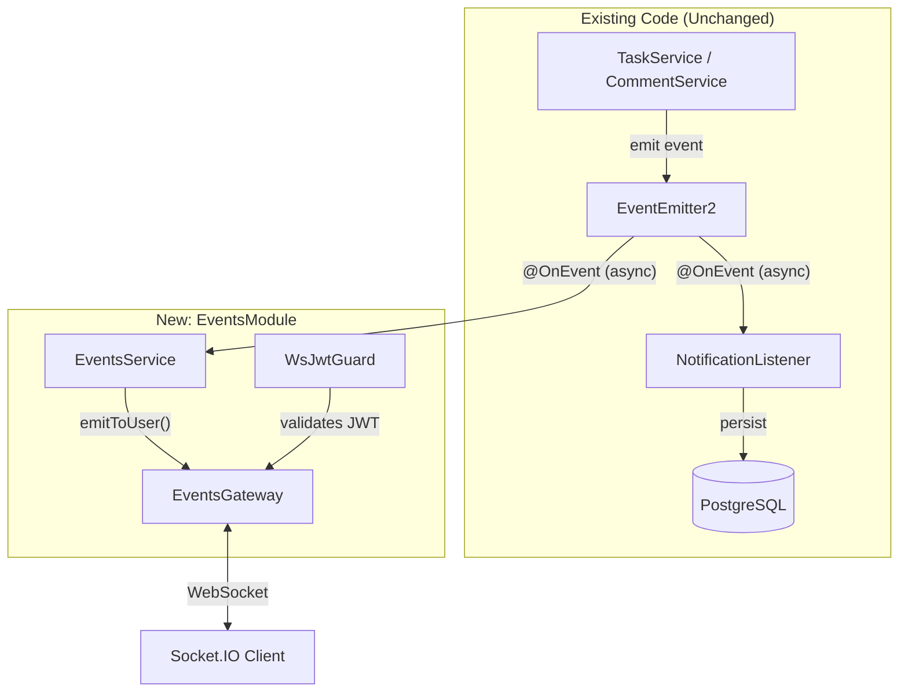
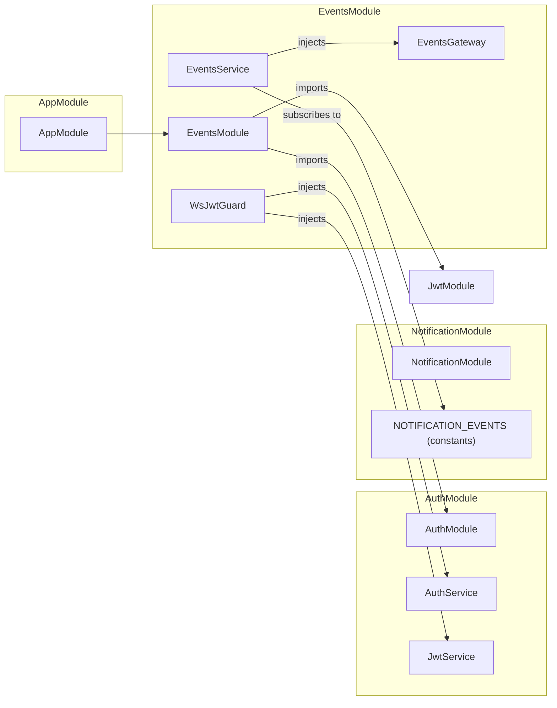
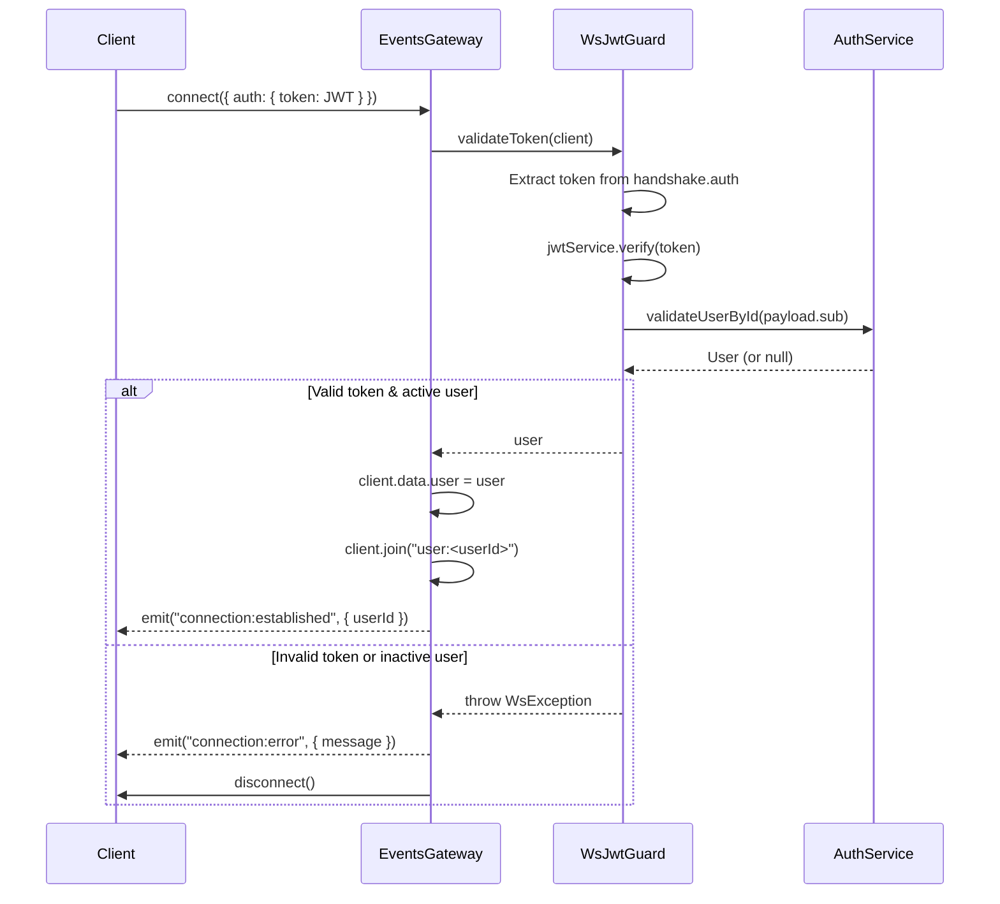
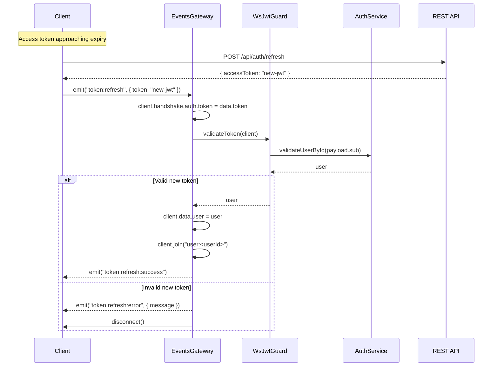
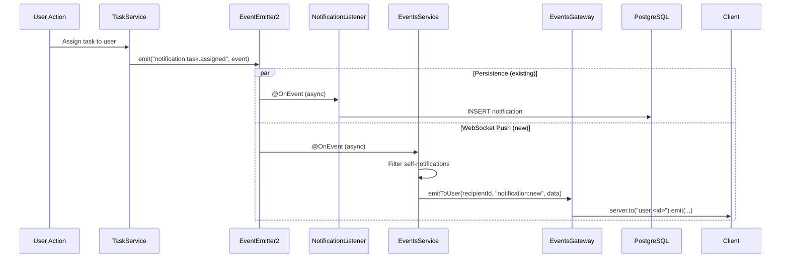
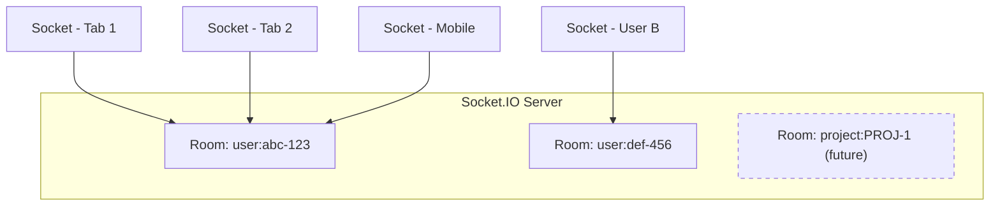
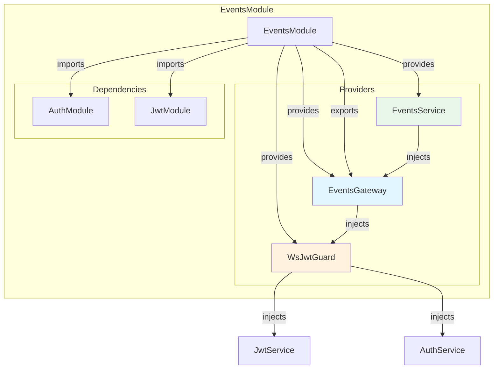
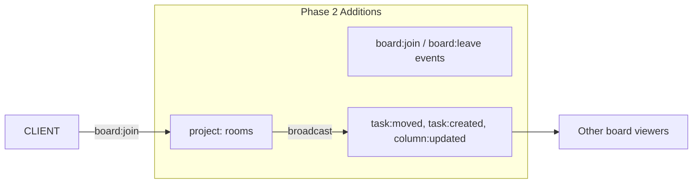

# WebSocket Real-Time Notifications — Technical Document

**Feature:** KAN-73 — WebSocket Support for Real-Time Notifications
**Date:** 2026-04-30
**Status:** Implemented
**Branch:** `feat/KAN-73`

---

## 1. Overview

### Summary

This feature adds real-time WebSocket support to the Kanban backend using Socket.IO, enabling instant notification delivery to connected clients. When a notification-triggering action occurs (comment created, task assigned, etc.), the affected user receives the notification in real time over an open WebSocket connection — no polling required.

### Problem It Solves

Previously, users had to poll `GET /api/notifications` to discover new notifications. This creates two problems:

- **Latency:** Users see notifications only on the next poll interval (seconds to minutes of delay).
- **Wasted bandwidth:** Most poll requests return empty results, generating unnecessary HTTP traffic and database queries.

WebSocket connections eliminate both issues — the server pushes notifications the instant they're created, and no traffic flows when there's nothing to send.

---

## 2. Architecture & Design

### High-Level Structure

The implementation follows a **zero-coupling observer pattern**. A new `EventsModule` subscribes to the same `EventEmitter2` events that the existing `NotificationListener` uses for DB persistence. The two listeners operate independently — the WebSocket layer was added without modifying a single line of existing notification code.



### Module Integration



### File Structure

```
src/modules/events/
├── events.module.ts            # Module definition — imports AuthModule, JwtModule
├── events.gateway.ts           # Socket.IO gateway — connection lifecycle, token refresh
├── events.service.ts           # EventEmitter2 listener — forwards events to gateway
├── guards/
│   └── ws-jwt.guard.ts         # JWT validation for WebSocket handshake
├── dto/
│   └── ws-notification.dto.ts  # Notification payload shape (for future use)
└── events.gateway.spec.ts      # 12 unit tests
```

---

## 3. Technical Decisions

### Decision 1: Separate Module vs. Extending NotificationModule

**Chosen:** Dedicated `EventsModule`

**Reasoning:** WebSocket is an infrastructure concern, not a notification-specific concern. Placing it in its own module means:
- Board updates (phase 2) can be added without touching notification code.
- The gateway can be injected by any module that needs real-time push.
- Clear single-responsibility boundaries.

**Alternative considered:** Adding the gateway inside `NotificationModule`. Rejected because it couples transport (WebSocket) to domain (notifications), and would require scattering gateway references across modules when board updates are added later.

### Decision 2: Event Subscription vs. Post-Persistence Hook

**Chosen:** Subscribe to the same pre-persistence `EventEmitter2` events as `NotificationListener`

**Reasoning:** This achieves zero coupling — the `EventsService` listens to events that already exist. No changes to `NotificationListener`, `NotificationService`, or any service that emits events.

**Trade-off:** The WebSocket payload does not include the DB-generated notification `id` or DB `created_at` timestamp, since the push fires before persistence. This is acceptable because:
- The push is a lightweight signal ("something happened"), not a data sync mechanism.
- Clients can fetch the full notification via `GET /api/notifications` if they need the `id`.
- `createdAt` is set to emit-time, which is close enough for display purposes.

### Decision 3: No `@UseGuards` on `token:refresh`

**Chosen:** Validate the new token directly inside the handler, without the `@UseGuards(WsJwtGuard)` decorator.

**Reasoning:** NestJS guards run *before* the handler. If the guard validates the handshake token (which is the old, possibly expired token), the refresh would be blocked before the handler can process the new token. By removing the guard and calling `validateToken()` manually with the new token, the refresh flow works correctly even when the original token has expired.

### Decision 4: User Rooms for Notification Routing

**Chosen:** `user:<userId>` rooms via Socket.IO

**Reasoning:** Notifications are always recipient-specific (`recipient_id`). User rooms map directly to this model. Multiple tabs/devices from the same user auto-join the same room, so all sessions receive the notification. No fan-out logic needed.

### Decision 5: Handshake Auth + Client-Driven Refresh

**Chosen:** JWT in handshake `auth` object on connect, with `token:refresh` event for mid-session re-auth.

**Alternatives considered:**
- **Token in every message:** Excessive overhead, poor DX.
- **Handshake only (no refresh):** Would force disconnect/reconnect on token expiry (1h), breaking the user's real-time experience.

The chosen approach validates once on connect (reject unauthorized immediately), then allows the client to seamlessly refresh without reconnecting.

---

## 4. Implementation Details

### Connection Lifecycle



### Token Refresh Flow



### Notification Push Flow



### Event Types Handled

| EventEmitter2 Event | WebSocket Event | Recipient Pattern |
|---------------------|-----------------|-------------------|
| `notification.comment.created` | `notification:new` | Single `recipient_id` |
| `notification.comment.mentioned` | `notification:new` | Array `recipient_ids[]` |
| `notification.task.assigned` | `notification:new` | Array `recipient_ids[]` |
| `notification.task.updated` | `notification:new` | Array `recipient_ids[]` |

All events are filtered to exclude self-notifications (actor === recipient).

### WebSocket Event Contract

**Server to Client:**

| Event | Payload | Description |
|-------|---------|-------------|
| `notification:new` | `{ type, actorId, entityType, entityId, payload, createdAt }` | Lightweight push (no DB id; createdAt is emit-time) |
| `connection:established` | `{ userId }` | Auth succeeded |
| `connection:error` | `{ message }` | Auth failed, connection will be closed |
| `token:refresh:success` | `{}` | New token accepted |
| `token:refresh:error` | `{ message }` | New token rejected, connection will be closed |

**Client to Server:**

| Event | Payload | Description |
|-------|---------|-------------|
| `token:refresh` | `{ token: string }` | Submit a fresh JWT |

### Room Strategy



- Each user auto-joins `user:<userId>` on connect.
- Multiple connections from the same user join the same room.
- `project:<projectId>` rooms are planned for phase 2 (board updates).

---

## 5. Component Hierarchy Diagram



---

## 6. Performance Considerations

### Optimizations Used

- **Async event listeners (`{ async: true }`):** `EventsService` handlers are non-blocking. The original event emitter does not wait for WebSocket push to complete before returning to the caller (e.g., `TaskService`).
- **Room-based routing:** `server.to("user:<id>").emit(...)` is O(1) per room lookup in Socket.IO — no iteration over all connected sockets.
- **No DB queries in the push path:** `EventsService` reads data directly from the event object. The only DB hit is in `WsJwtGuard.validateToken()` during connection/refresh (not per-notification).
- **Self-notification filtering:** Skipped before the emit call, avoiding unnecessary room lookups.

### Potential Bottlenecks

| Bottleneck | Trigger | Mitigation |
|-----------|---------|------------|
| Single-process Socket.IO | >10K concurrent connections | Add `@socket.io/redis-adapter` to distribute across processes |
| Memory per socket | High connection count | Socket.IO uses ~2-5KB per connection; monitor with process metrics |
| Event emitter fan-out | Many notification types | Current 4 event types are fine; consider batching if it grows to 20+ |
| `validateUserById` on connect | Connection storms (deploy, network blip) | Already cached by TypeORM query; consider adding a short TTL cache if needed |

---

## 7. Edge Cases & Limitations

### Handled Edge Cases

| Edge Case | Handling |
|-----------|---------|
| Self-notification (actor === recipient) | Filtered out before emit |
| Missing `handshake.auth` on token refresh | Initialized to `{}` before assignment |
| Token expired mid-session | Client emits `token:refresh` with a new token obtained via REST |
| Multiple tabs/devices | All join same `user:<id>` room; all receive notifications |
| User disconnects | Socket.IO auto-removes from rooms; no custom cleanup needed |
| Inactive user attempts connection | `AuthService.validateUserById()` returns null; connection rejected |
| `WsException` re-thrown correctly | Specific errors (e.g., "User not found") propagate without being swallowed by the generic catch |

### Known Limitations

| Limitation | Impact | Planned Resolution |
|-----------|--------|-------------------|
| No offline delivery queue | Offline users rely on REST polling to catch up | Phase 3: Redis-backed queue, flush on reconnect |
| No notification `id` in push payload | Client can't mark-as-read from the push alone | Client fetches full notification via REST if needed |
| `createdAt` is emit-time, not DB time | Minor discrepancy (milliseconds) vs. persisted `created_at` | Acceptable for display; REST API is source of truth |
| Single server only | No cross-process socket state sharing | Add `@socket.io/redis-adapter` when scaling horizontally |
| No rate limiting on `token:refresh` | Malicious client could spam refresh events | Add throttle guard if abuse is observed |

---

## 8. Future Improvements

### Phase 2: Board Updates (Real-Time Collaboration)



- Users join `project:<projectId>` rooms when viewing a board.
- `EventsService` subscribes to task/column `EventEmitter2` events (already emitted by `TaskService`).
- Broadcasts changes to all users viewing the same board.

### Phase 3: Offline Delivery Queue

- Buffer missed notifications in Redis (per-user sorted set).
- On reconnect, flush queued events to the client.
- TTL on queued events (e.g., 7 days) to prevent unbounded growth.

### Phase 4: Horizontal Scaling

- Add `@socket.io/redis-adapter` so multiple server instances share socket state.
- No code changes in the gateway — the adapter is transparent.

### Other Improvements

| Improvement | Rationale |
|------------|-----------|
| Presence tracking (`user:online` events) | Show who's online on the board |
| Typing indicators (comment box) | Real-time collaboration signal |
| Connection health monitoring | Track connection counts, error rates in Grafana |
| WebSocket-specific rate limiting | Protect against abusive clients |

---

## Appendix: Client Integration Example

```typescript
import { io } from 'socket.io-client';

const socket = io('http://localhost:1996', {
  auth: { token: accessToken },
});

socket.on('connection:established', ({ userId }) => {
  console.log(`Connected as ${userId}`);
});

socket.on('connection:error', ({ message }) => {
  console.error(`Auth failed: ${message}`);
});

socket.on('notification:new', (notification) => {
  // { type, actorId, entityType, entityId, payload, createdAt }
  showNotificationToast(notification);
});

// When access token is about to expire:
async function refreshSocketToken() {
  const { accessToken: newToken } = await api.post('/auth/refresh');
  socket.emit('token:refresh', { token: newToken });
}

socket.on('token:refresh:success', () => {
  console.log('Socket token refreshed');
});

socket.on('token:refresh:error', () => {
  // Socket will be disconnected; reconnect with new token
  socket.auth = { token: newAccessToken };
  socket.connect();
});
```
